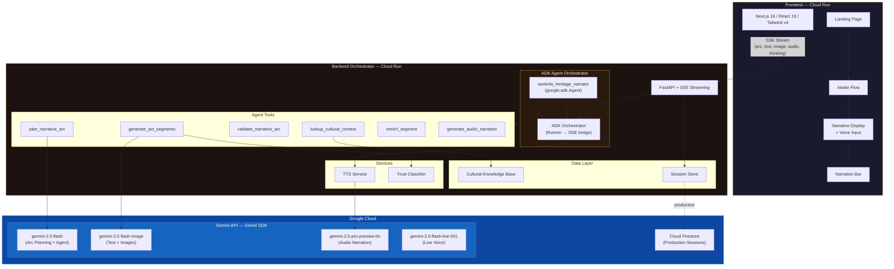

# Sankofa — Ancestral Heritage Narrator

> *"Se wo were fi na wosankofa a yenkyi."* — It is not wrong to go back for that which you have forgotten.

<!-- TODO: Add screenshot or GIF of the narrative experience here -->
<!--  -->

Sankofa is a multimodal AI agent that transforms sparse personal and familial inputs into immersive heritage narratives — weaving together oral-history-style narration, AI-generated period imagery, ambient audio, and contextual text into a single cohesive experience.

Named after the Akan concept of "go back and get it," Sankofa addresses a profound gap: hundreds of millions of people in diaspora communities have lost tangible connection to their ancestral heritage.

**Sankofa doesn't just tell you where you're from — it makes you *feel* it.**

## The Problem

An estimated 200+ million people in the African diaspora alone have limited or no access to their ancestral stories. Existing tools give data (DNA percentages, country names) without emotional resonance. Heritage is inherently multimodal — it lives in the sound of a language, the landscape of a homeland, the visual texture of traditional craft, and the rhythm of oral storytelling. No single modality can capture it.

## What It Does

A user provides a few seeds: a family surname, a country or region, a time period, and optionally any fragments they know. From these seeds, Sankofa generates a flowing, interleaved narrative with:

- **Griot-inspired narration** — Warm, oral storytelling voice grounded in historical fact
- **AI-generated period imagery** — Watercolor-style illustrations of landscapes, people, and cultural artifacts
- **Trust indicators** — Every segment marked as Historical, Cultural, or Reconstructed
- **Audio narration** — TTS audio for each text segment in a warm storytelling voice (persistent narration bar with track list, seek, auto-advance, and integrated mic button). Audio is always enabled.
- **Follow-up exploration** — Ask Sankofa to go deeper into any aspect of the heritage, with answers streaming in segment-by-segment via SSE
- **Live voice conversation** — Talk to the Griot in real-time via the mic button in the narration bar, powered by Gemini Live API, with two immersive UI modes:
  - **Glassmorphism dock** — When a narrative is visible, the voice panel slides up as a frosted-glass bottom dock (`backdrop-blur-xl`), keeping the story and images visible behind it
  - **Ambient full-screen** — When no narrative exists yet, a warm radial gradient with floating gold particles and an optional Ken Burns background image replaces the old dark overlay
- **Voice input** — Speak your follow-up questions using the mic button (Web Speech API) — no typing required
- **Ambient background audio** — Each act plays a soft ambient soundscape that crossfades between acts, with a mute toggle. Ten compressed MP3 tracks are selected contextually by the arc planner: `wind.mp3`, `fire.mp3`, `nature.mp3`, `market.mp3`, `drums.mp3`, `rain.mp3`, `ocean.mp3`, `river.mp3`, `crickets.mp3`, `village.mp3`. Files are lazy-loaded (`preload="none"`) to avoid competing with page resources
- **ADK-orchestrated generation** — The Gemini ADK agent actively decides tool order, validates the arc, and adapts on the fly (with a direct-pipeline fallback via `use_adk=false`)

### Experience & Immersion

The frontend is built for a **cinematic, fluid** reading experience rather than a static page:

- **Cinematic griot intro** — While the backend generates the narrative, a pre-generated griot voiceover (~98 seconds) plays over a dark cinematic overlay with synchronized text beats, gold particles, and a slowly rotating Sankofa bird. The intro monologue introduces the griot storytelling tradition and the concept of Sankofa. Text lines fade in and out in sync with the audio using CSS keyframe animations (GPU-composited `transform` + `opacity` only). Users can "Skip intro" at any time. If generation finishes during the intro, the component transitions to a "Your story is ready" screen with a second short audio clip and a golden "Begin" button. If generation is still running when the intro ends, the waiting phase shows arc cards, fun facts, and progress indicators. Static audio assets (`griot-intro.mp3`, `griot-ready.mp3`) are generated once via `scripts/generate_griot_intro_audio.py` using the same Gemini TTS pipeline as the narrative audio.
- **Seamless intake-to-generation transition** — After completing the intake questions, users see an immersive "Preparing your narrative…" screen with gold particles and warm gradient. The narrative page auto-starts streaming on arrival — no intermediate "Ready to weave" step. Audio is always enabled. The visual language is consistent across the transition.
- **Progressive streaming** — The narrative arc (act titles) is sent as soon as it's planned, so users see chapter teasers while the full story is still generating. The loading screen holds until both text and audio are ready, so the narrative reveals fully formed rather than piece-by-piece. Rotating heritage fun facts keep users engaged during generation.
- **Heritage fun facts** — During the loading screen, rotating "Did you know?" facts about African history, diaspora culture, and oral traditions cycle every 8 seconds, keeping users engaged while the narrative generates.
- **Word-by-word text reveal** — New narrative text animates in word-by-word with a staggered fade, evoking the cadence of a griot speaking. The effect runs only on first appearance.
- **Cinematic image reveals** — Images enter with a soft blur-to-sharp transition; hero images get a warm vignette and a sepia-to-full-color reveal. A subtle golden shimmer fades away as the image materializes.
- **Act transitions** — Between acts, a full-width divider shows the Sankofa bird, act numeral, and title (from the arc outline), with floating gold particles and an expanding gold line.
- **Ambient atmosphere** — Floating gold particles drift on the landing, intake submitting, and narrative loading screens; the narrative page background gradient shifts subtly by act (earth tones → deeper warmth → dawn). The loading screen features a breathing bird animation (composite scale + rotation), concentric pulse rings that expand outward like a heartbeat, an ambient gradient drift ("breathing light" effect), and a golden shimmer sweep across arc chapter cards. The landing page includes a radial glow behind the Sankofa bird. Per-act ambient soundscapes (wind, fire, nature, market, drums, rain, ocean, river, crickets, village) crossfade smoothly between acts at low volume, with a mute toggle in the corner. Track selection is driven by the arc planner — both the Gemini and fallback arcs include an `ambient_track` field per act, validated against the ten available tracks.
- **Audio-synced reading** — When narration is playing, the active segment gets a warm sidebar glow, a soft background tint, and a reading-sweep highlight that progresses through the text using the actual audio duration. Pausing the audio freezes all highlight animations in place; resuming continues them. Non-active segments dim for focus.
- **Scroll progress** — A fixed vertical progress bar on the left shows how far you've scrolled through the story, with act markers that fill as you pass each act.
- **Immersive LiveGriot UI** — The voice conversation panel adapts to context: a translucent bottom dock over the narrative (glassmorphism with `backdrop-blur-xl`) or an ambient full-screen mode with warm gradients, gold particles, and a slow Ken Burns zoom on the latest narrative image. Accessed via the mic button in the narration bar.

## Architecture



## Tech Stack

| Component | Technology | Google Cloud Service |
|---|---|---|
| AI Models | Gemini 2.5 Flash Image (narrative + images), Gemini 2.5 Pro Preview TTS (audio), Gemini 2.5 Flash (arc planning + agent), Gemini 2.0 Flash Live (voice conversation) | Vertex AI / GenAI SDK |
| Agent Orchestration | Google Agent Development Kit (ADK) — `sankofa_heritage_narrator` agent with full tool suite for narrative generation, plus `sankofa_heritage_live_narrator` with a filtered conversation-only tool set for live voice | ADK + GenAI SDK |
| Backend | Python 3.12 / FastAPI | Cloud Run |
| Frontend | Next.js 16 / React 19 / Tailwind CSS v4 / Motion (motion/react) | Cloud Run |
| Streaming | SSE via sse-starlette — initial narrative + follow-ups both stream via SSE; "thinking aloud" status messages show agent progress | Cloud Run |
| Voice Input | Web Speech API (browser-native) for voice follow-up questions | — |
| Live Voice | Gemini Live API full-duplex voice conversation with the Griot | GenAI SDK |
| Session Store | In-memory (default) or Firestore via `USE_FIRESTORE` | Firestore (production) |

## Supported Regions

### Deep Coverage (detailed decade-by-decade data)
- **West Africa:** Ghana (Gold Coast), Nigeria (Yorubaland), Senegambia, Dahomey (Benin), Sierra Leone
- **East Africa:** Kenya, Tanzania (including Zanzibar), Ethiopia
- **Caribbean:** Jamaica, Haiti, Trinidad and Tobago
- **South Asia:** Punjab (India/Pakistan), Bengal (India/Bangladesh)

### Generic Coverage (Gemini knowledge-grounded)
- Any region worldwide — Sankofa will use its general knowledge when detailed knowledge base data isn't available

## Local Development

### Prerequisites
- Python 3.12+
- Node.js 20+
- A Google API key with Gemini API access (or GCP project with Vertex AI)

### Backend

**Run all backend commands from the `backend` directory** (so Python finds the `app` package and `requirements.txt`):

```bash
cd backend
cp .env.example .env   # Edit with your Google API key (from https://aistudio.google.com/apikey)
pip install -r requirements.txt
python -m uvicorn app.main:app --reload --port 8000
```

**PowerShell (Windows):**
```powershell
cd backend
copy .env.example .env   # Edit .env with your Google API key
pip install -r requirements.txt
python -m uvicorn app.main:app --reload --port 8000
```

- Use `python -m uvicorn` if `uvicorn` is not on your PATH (e.g. when not activating a venv).
- **Windows:** If `--reload` causes a permission or multiprocessing error, run without reload:  
  `python -m uvicorn app.main:app --host 127.0.0.1 --port 8000` (restart the process manually after code changes).
- The backend reads `.env` only at startup; restart the backend after changing any `.env` values.

### Frontend

```bash
cd frontend
cp .env.local.example .env.local
npm install
npm run dev
```

Visit http://localhost:3000 to begin.

### Test API and network

With the backend running, verify it’s reachable:

```powershell
# PowerShell
Invoke-RestMethod -Uri "http://localhost:8000/api/health" -Method Get
```

You should see `status: healthy` and `service: sankofa-api`. In the app, a small "Test API connection" link appears at the bottom of the loading screen as a diagnostic fallback.

## ADK Agent Orchestration

The narrative pipeline is orchestrated by an ADK agent (`sankofa_heritage_narrator`) rather than hard-coded function calls. The agent decides tool order, validates its own output, and adapts dynamically:

1. **Context gathering** — `lookup_cultural_context` → `assess_context_quality` → (if sparse) `research_region_history`
2. **Arc planning with validation** — `plan_narrative_arc` (includes per-act `ambient_track` selection) → `validate_narrative_arc` → re-plan if FAIL
3. **Per-act generation** — `generate_act_segments` called 3 times with continuity threading
4. **Enrichment** — `enrich_segment` upgrades RECONSTRUCTED segments with real historical detail
5. **Status updates** — `notify_user` surfaces progress to the frontend as "thinking aloud" messages

The `adk_orchestrator.py` module bridges the ADK Runner with SSE: it observes tool calls and results in real-time and emits the SSE events (`arc`, `text`, `image`, `audio`, `status`) that the frontend expects.

**Fallback:** Pass `use_adk=false` to the stream endpoint to bypass the agent and use the direct 3-step pipeline instead.

## Google Cloud Deployment

```bash
# Set your GCP project
export GOOGLE_CLOUD_PROJECT=your-project-id
export GOOGLE_CLOUD_LOCATION=us-central1

# Deploy (requires gcloud CLI)
chmod +x deploy.sh
./deploy.sh
```

## Session store (Firestore)

Sessions are persisted in **Firestore** in production so they survive restarts. Locally, the backend uses an **in-memory** store by default.

- **Config:** Set `USE_FIRESTORE=true` and `GOOGLE_CLOUD_PROJECT` when using Firestore. Optional: `FIRESTORE_SESSIONS_COLLECTION` (default `sessions`).
- **Data model:** One Firestore document per session (document ID = `session_id`) with `user_input`, `narrative_context`, `is_generating`, and `arc_outline`. Segments are stored in a **subcollection** `segments` (one doc per segment, keyed by sequence) to stay under Firestore’s 1 MiB document limit when narratives include base64 images and audio.
- **Backend:** `app/store/` provides the active store: `FirestoreSessionStore` (when `USE_FIRESTORE=true`) or `InMemorySessionStore`. Routes use `session_store` from `app.store`; no route logic depends on which backend is used.
- **Deployment:** The deploy script sets `USE_FIRESTORE=True` for the backend. Enable the Firestore API and grant the Cloud Run service account the **Cloud Datastore User** role. See `backend/docs/DEPLOYMENT.md` for steps.

## Error Handling

Error handling across the backend and frontend is documented in **[docs/ERROR_HANDLING.md](docs/ERROR_HANDLING.md)**. That report covers:

- Where and how errors are handled (config, validation, HTTP, SSE stream, Gemini, TTS, session store, frontend API and UI)
- Identified bugs and fixes
- Recommendations for improvement (sanitized stream errors, Firestore guards, global exception handler, SSE timeout, React error boundary, etc.)

## Trust & Accuracy

Sankofa clearly distinguishes between:
- **Historical** — Based on documented historical facts about the region and era
- **Cultural** — Based on well-documented cultural practices of the community
- **Reconstructed** — Imaginative reconstruction informed by historical context

These appear as subtle margin annotations in the narrative, building trust without breaking the storytelling flow. Sankofa never fabricates specific genealogical claims.

## Hackathon

Built for the **Gemini Live Agent Challenge** (Google / Devpost) in the **Creative Storyteller** category.

**🏆 Won the Creative Storytellers category** and **presented at Google Cloud Next 2026**.

<!-- TODO: Add live demo link when deployed -->
<!-- **[Try the Live Demo →](https://sankofa.app)** -->

## Author

**Jeremiah Sakuda**

---

*Sankofa — because heritage is not data. It's a story.*
